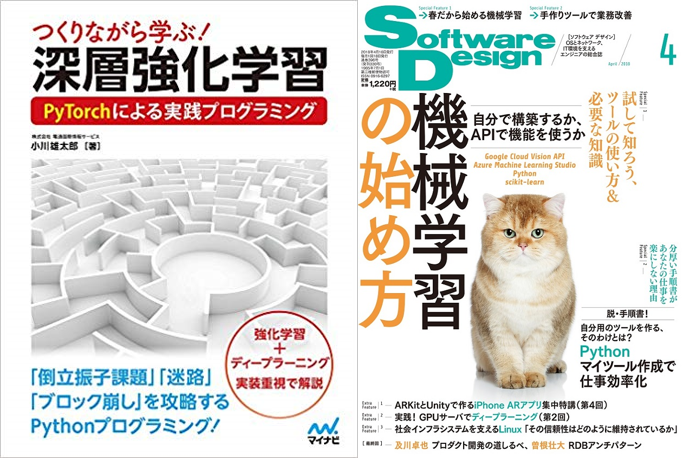

### 氏名
小川雄太郎[（LinkedIn）](https://www.linkedin.com/in/yutaroogawa/)

### 業務
SIerの技術本部・開発技術部に所属。ディープラーニングをはじめとした機械学習関連技術の研究開発・技術支援、ならびに社内の働き方改革に伴うHRデータ解析を業務とする。

明石工業高等専門学校、東京大学工学部を経て、東京大学大学院、神保・小谷研究室にて脳機能計測および計算論的神経科学の研究に従事し、2016年博士号(科学)を取得。

東京大学特任研究員を経て、2017年4月より現職。

### 最近の外部活動
- [【教育】早稲田大学・グローバルエデュケーションセンター非常勤講師。講義「AIビジネスクリエーション（ISID連携）」を担当](https://d-data.jp/curriculum/2019/biz/ai-biz_creation-a)

- [【出版】つくりながら学ぶ! 深層強化学習 PyTorchによる実践プログラミング](https://www.amazon.co.jp/%E3%81%A4%E3%81%8F%E3%82%8A%E3%81%AA%E3%81%8C%E3%82%89%E5%AD%A6%E3%81%B6-%E6%B7%B1%E5%B1%A4%E5%BC%B7%E5%8C%96%E5%AD%A6%E7%BF%92-PyTorch%E3%81%AB%E3%82%88%E3%82%8B%E5%AE%9F%E8%B7%B5%E3%83%97%E3%83%AD%E3%82%B0%E3%83%A9%E3%83%9F%E3%83%B3%E3%82%B0-%E9%9B%BB%E9%80%9A%E5%9B%BD%E9%9A%9B%E6%83%85%E5%A0%B1%E3%82%B5%E3%83%BC%E3%83%93%E3%82%B9-%E9%9B%84%E5%A4%AA%E9%83%8E/dp/4839965625/ref=sr_1_1?s=books&ie=UTF8&qid=1528591901&sr=1-1&keywords=%E6%B7%B1%E5%B1%A4%E5%BC%B7%E5%8C%96%E5%AD%A6%E7%BF%92)

- [【寄稿】「SoftWare Design」18年4月号にて「特集 機械学習の始め方」の第4章を寄稿](http://gihyo.jp/magazine/SD/archive/2018/201804)

- [【連載】「SoftWare Design」18年5月号より「scikit-learnで学ぶ機械学習アルゴリズム」の記事連載中（共同執筆）](http://gihyo.jp/magazine/SD/)

- [【教育】早稲田大学・講義「イノベーションとテクノロジー実践アルファ」にて「AI・機械学習のビジネス事例と継続的・効果的に機械学習プロジェクトを生み出す方法」_181024](https://www.facebook.com/media/set/?set=a.969840696559701&type=3)

- [【外部委員】日本ディープラーニング協会　委員](http://www.jdla.org/)

### Qiita
- [すぐる@sugulu](https://qiita.com/sugulu)
　

### 経歴
- 2002年4月 - 2007年3月: 明石工業高等専門学校 電子情報工学科 卒業
- 2007年4月 - 2010年3月: 東京大学工学部 精密工学科 卒業
- 2010年4月 - 2012年3月: 東京大学大学院 新領域創成科学研究科 修士課程 修了    
- 2012年4月 - 2016年3月: 東京大学大学院 新領域創成科学研究科 博士課程 卒業
- 2016年3月博士号（科学）取得
- 2016年4月 - 2017年3月：東京大学 先端科学技術研究センター 特任研究員
- 2017年4月より：SIerの技術本部・開発技術部に所属

### 研究
- ワーキングメモリに関わる脳波・脳血流の計測・解析
- 遅延微分方程式で記述される神経集団モデルの縮約手法開発と、ワーキングメモリ活動に伴う脳波位相同期現象の解明

について研究を行ってきました。

#### 代表論文
- Ogawa, Y., Kotani, K., & Jimbo, Y. (2014). Relationship between working memory performance and neural activation measured using near‐infrared spectroscopy. Brain and behavior, 4(4), 544-551.

- Ogawa, Y., Yamaguchi, I., Kotani, K., & Jimbo, Y. (2017). Estimating the parameters of neural mass models including time delay and nonlinearity using a particle filter: a preliminary study toward model‐based EEG analysis. IEEJ Transactions on Electrical and Electronic Engineering, 12(6), 899-906.

- Ogawa, Y., Yamaguchi, I., Kotani, K., & Jimbo, Y. (2017). Deriving theoretical phase locking values of a coupled cortico-thalamic neural mass model using center manifold reduction. Journal of computational neuroscience, 42(3), 231-243.

### その他活動

- [マイナビ出版のITサイトManateeにて連載「作りながら学ぶ強化学習 -初歩からPyTorchによる深層強化学習まで」](https://book.mynavi.jp/manatee/series/detail/id=87626)

- [脳科学若手の会 代表 2012年度](http://brainsci.jp/)

- [【教育】ドワンゴ脳型汎用人工知能開発者育成ニコニコAIスクール第3、4回講師_2018年1月](http://nico2.ai/ml-handson/)

- [【教育】東京学芸大学の「情報教育とキャリア形成」科目にて、講義「AI・人工知能の概要とビジネス事例の紹介」_2018年11月](http://joho.u-gakugei.ac.jp/e/lecture/)

- [高専ロボコン 05年第18回大会「大運動会」：Curvilinear（カーヴェリニアー）。近畿地区大会優勝、全国大会出場](http://www.akashi.ac.jp/alumni/wp-content/uploads/sites/8/2014/03/alm_com7.pdf)
