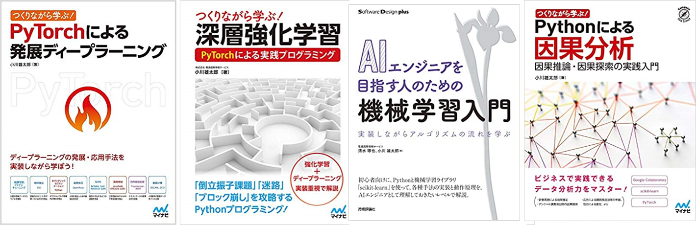

### 氏名

小川雄太郎[（LinkedIn はこちらから）](https://www.linkedin.com/in/yutaroogawa/)

### 業務

SIer の AI テクノロジー部に所属。ディープラーニングをはじめとした機械学習関連技術の研究開発、教育、コンサルティング、受託案件、アジャイルでのソフトウェア開発を業務とする。

明石工業高等専門学校、東京大学工学部を経て、東京大学大学院、神保・小谷研究室にて脳機能計測および計算論的神経科学の研究に従事し、2016 年博士号(科学)を取得。東京大学特任研究員を経て、2017 年 4 月より現職。

「つくりながら学ぶ! 深層強化学習 PyTorch による実践プログラミング」、「つくりながら学ぶ! PyTorch による発展ディープラーニング」、「つくりながら学ぶ! Python による因果分析 ~因果推論・因果探索の実践入門」、「AI エンジニアを目指す人のための機械学習入門」などを執筆。

その他、早稲田大学・グローバルエデュケーションセンター非常勤講師、および日本ディープラーニング協会 委員を務める。

### 最近の対外活動（書籍出版）

- [【出版】つくりながら学ぶ! Python による因果分析 ~因果推論・因果探索の実践入門（20 年 6 月）](https://www.amazon.co.jp/dp/4839973571/)

- [【出版】AI エンジニアを目指す人のための機械学習入門 実装しながらアルゴリズムの流れを学ぶ（20 年 4 月）](https://www.amazon.co.jp/dp/4297112094/)

* [【出版】つくりながら学ぶ! PyTorch による発展ディープラーニング（19 年 7 月）](https://www.amazon.co.jp/dp/4839970254/)

* [【出版】つくりながら学ぶ! 深層強化学習 PyTorch による実践プログラミング（18 年 6 月）](https://www.amazon.co.jp/dp/4839965625/)

### 最近の対外活動（外部発表）

- [【イベント発表】DLLAB 自然言語処理ナイト](https://dllab.connpass.com/event/177785/)、[「NLP ソリューション開発の最前線」（20 年 7 月）⇒ 発表スライドはこちらから](https://www.slideshare.net/DeepLearningLab/nlp-236520444)

- [【イベント発表】第 46 回 Machine Learning 15minutes! Broadcast](https://machine-learning15minutes.connpass.com/event/179689/)、[「SIer で自然言語処理 AI 製品をアジャイル開発した際の試行錯誤」（20 年 8 月）⇒ 発表スライドはこちらから](https://drive.google.com/file/d/1xT_o7YbfLWfSBrjSw4l3-h2uAolS9jPe/view?fbclid=IwAR3SlNzvg1kCVYZpD7IFOiBkoy9kz9RmDIkIbFGyCPw43ZpuNCCnuuaJMLM)

- [【学会発表】東京学芸大学山田、櫨山、小川。人工知能学会 2020@熊本、「OSS プロジェクトの Issue 議論内容に対する BERT および AutoML を用いた文章分類の提案」（20 年 6 月）](https://confit.atlas.jp/guide/event/jsai2020/subject/3Rin4-08/advanced)

- [【カンファレンス発表】DLLAB Engineer Days Day2: Conference](https://dllab.connpass.com/event/144647/)、[「BERT による文書系 AI の取り組みと、Azure を用いたテーブルデータの説明性実現！」（19 年 10 月）⇒ 発表スライドはこちらから](https://www.slideshare.net/DeepLearningLab/bertaiazure?ref=https://dllab.connpass.com/event/144647/presentation/)

- [【イベント発表】TechPlay 　進化する SIer の最前線！](https://techplay.jp/event/758740)、[「AI テクノロジー部の研究開発と製品開発事例」（19 年 12 月）⇒ 当日レポートと発表スライドはこちらから](https://techplay.jp/column/910?fbclid=IwAR3Di0Wad0y2sjjnlyZHlUaa_mHzC9Cf0aSaBY6MwE_ll8tMH9rsORo7E3k)

* [【カンファレンス発表】DLLAB_interpretabilityNight](https://dllab.connpass.com/event/153453/)、[「BlackBox モデルの説明性・解釈性技術の実装」（19 年 10 月）⇒ 発表スライドはこちらから](https://www.slideshare.net/DeepLearningLab/blackbox-198324328)

- [【カンファレンス発表】早稲田大学：データサイエンス活用の最前線 ～ ISID のビジネス事例と産学連携・研究助成の解説～、研究教育活動を積極的に連携して推進するために包括協定を締結*研究助成金*公募の説明と想い」（19 年 10 月）](https://www.waseda.jp/inst/cds/news/1049)

* [【学会発表】人工知能学会 2019@新潟、「勾配ブースティング回帰木を用いた製造業流体シミュレーションの高速化手法」（19 年 6 月）](https://confit.atlas.jp/guide/event/jsai2019/session/3Q01-04/advanced)

### 最近の対外活動（その他）

- [【外部委員】日本ディープラーニング協会 委員（18 年～）](http://www.jdla.org/)

- [【教育】早稲田大学・グローバルエデュケーションセンター非常勤講師。講義「AI ビジネスクリエーション」を担当（19 年）](https://d-data.jp/curriculum/2019/biz/ai-biz_creation-a)

- [【連載】「SoftWare Design：scikit-learn で学ぶ機械学習アルゴリズム」（共同執筆）（18 年 5 月号～ 19 年 1 月号）](https://gihyo.jp/magazine/SD/backnumber)

### Qiita

- [すぐる@sugulu](https://qiita.com/sugulu)

### 経歴

- 2002 年 4 月 - 2007 年 3 月: 明石工業高等専門学校 電子情報工学科 卒業
- 2007 年 4 月 - 2010 年 3 月: 東京大学工学部 精密工学科 卒業
- 2010 年 4 月 - 2012 年 3 月: 東京大学大学院 新領域創成科学研究科 修士課程 修了
- 2012 年 4 月 - 2016 年 3 月: 東京大学大学院 新領域創成科学研究科 博士課程 卒業
- 2016 年 3 月博士号（科学）取得
- 2016 年 4 月 - 2017 年 3 月：東京大学 先端科学技術研究センター 特任研究員
- 2017 年 4 月より：SIer の技術本部・開発技術部に所属
- 2019 年 9 月より：同上・AI テクノロジー部に所属

### 研究

- ワーキングメモリに関わる脳波・脳血流の計測・解析
- 遅延微分方程式で記述される神経集団モデルの縮約手法開発と、ワーキングメモリ活動に伴う脳波位相同期現象の解明

について研究を行ってきました。

#### 代表論文

- Ogawa, Y., Kotani, K., & Jimbo, Y. (2014). Relationship between working memory performance and neural activation measured using near‐infrared spectroscopy. Brain and behavior, 4(4), 544-551.

- Ogawa, Y., Yamaguchi, I., Kotani, K., & Jimbo, Y. (2017). Estimating the parameters of neural mass models including time delay and nonlinearity using a particle filter: a preliminary study toward model‐based EEG analysis. IEEJ Transactions on Electrical and Electronic Engineering, 12(6), 899-906.

- Ogawa, Y., Yamaguchi, I., Kotani, K., & Jimbo, Y. (2017). Deriving theoretical phase locking values of a coupled cortico-thalamic neural mass model using center manifold reduction. Journal of computational neuroscience, 42(3), 231-243.

- [研究業績一覧はこちら](./research_cv.md)

### その他活動

- [高専ロボコン 05 年第 18 回大会「大運動会」：Curvilinear（カーヴェリニアー）。近畿地区大会優勝、全国大会出場](http://www.akashi.ac.jp/alumni/wp-content/uploads/sites/8/2014/03/alm_com7.pdf)

- [脳科学若手の会 代表 2012 年度](http://brainsci.jp/)

- [【教育】ドワンゴ脳型汎用人工知能開発者育成ニコニコ AI スクール第 3、4 回講師\_2018 年 1 月](http://nico2.ai/ml-handson/)

- [マイナビ出版の IT サイト Manatee にて連載「作りながら学ぶ強化学習 -初歩から PyTorch による深層強化学習まで」](https://book.mynavi.jp/manatee/series/detail/id=87626)

- [【寄稿】「SoftWare Design」18 年 4 月号にて「特集 機械学習の始め方」の第 4 章を寄稿](http://gihyo.jp/magazine/SD/archive/2018/201804)

- [【教育】東京学芸大学の「情報教育とキャリア形成」科目にて、講義「AI・人工知能の概要とビジネス事例の紹介」\_2018 年 11 月](http://joho.u-gakugei.ac.jp/e/lecture/)

- [【教育】早稲田大学・講義「イノベーションとテクノロジー実践アルファ」にて「AI・機械学習のビジネス事例と継続的・効果的に機械学習プロジェクトを生み出す方法」\_18 年 10 月](https://www.facebook.com/media/set/?set=a.969840696559701&type=3)
